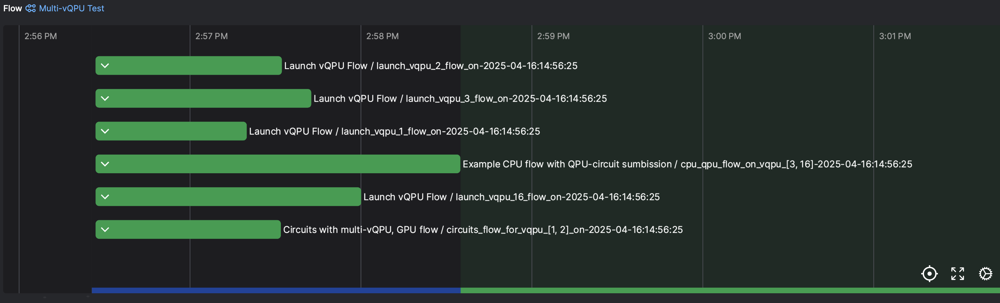

# QBitBridge 
A Prefect orchestrated framework for running hybrid workflows containing (v)QPU, GPU and CPU oriented tasks on HPC systems. 

## Description
This framework uses Prefect to orchesetrate asynchronous tasks and flows, an EventFile class that produces globally visible events to the orchestration process and all other processes, Dask for integration with Slurm to run hybrid workflows. 

The current setup is designed to integrate with the virtual QPU from Quantum Brilliance, a emulator for quantum circuit simulation that runs as a service, accepting circuits sent to a specific port with a specific API and format. Currently it has been tested with circuits produced by the Qristal SDK produced by Quantum Brilliance. 

The QPU integration is based on Quantum Brilliance, AWS Braket (WIP) and QuEra (WIP) as well. 

This setup is not fixed to Quantum Brilliance and could easily be expanded to include other vQPUs and QPUs as well.

It consists of a primary directory `workflow/` which contains 
- `vqpucommon/`: A directory containing all the utilities, classes and basic flows that are the building blocks for running a hybrid workflow. 
- `scripts/`: some scripts to help launch a POSTGres database and the prefect server. These scripts will use a container for running the database server.  
- `clusters/`: collection of example cluster configuration yaml files. Cluster configurations should contain `generic`, `circuit`, `vqpu`, `cpu`, and `gpu` configurations for running generic tasks, `circuit` tasks where circuit simluation is done with a `vqpu`, the `vqpu` tasks, and then `cpu` and `gpu` oriented workflows. There is also a '`generic-aws` setup to allow additional aws related information to be loaded in the environment. MPI will be forthcoming. 
- `circuits/`: collection of example circuits.
- `tests/`: python unit test for package 
- `example_flows`: a useful set of example workflows. 

There are other directories, such as `events` that are useful when running a workflow but these workflow oriented, temporary output directories can be located anywhere globally visible on the filesystem. 

### vqpucommon
The main classes and basic tasks of the hybrid flow are found in [vqpubase](workflow/vqpucommon/vqpubase.py) and [vqpuflow](workflow/vqpucommon/vqpuflow.py) respectively. The key components of the QBitBridge fraemwork is the introduction of the `EventFile` class (see [utils](workflow/vqpucommon/utils.py)), the `QPUMetaData` and `HybridQuantumWorkflowBase` classes (see [vqpubase](workflow/vqpucommon/vqpubase.py)). 

#### EventFile
The `EventFile` class is the interaface to storing events via a file globally visible to all processes. File is created if set and dependent tasks can be set to `await eventfile.wait()` for the file to be created and have appropriate information before moving on. Events can also be cleared. 

#### QPUMetaData
The `QPUMetaData` class contains the metadata associated with a (v)QPU, such as maximum number of qubits, connectivity, etc. This can then be compared to the requirements of a circuit to see if the (v)QPU can be used to run the circuit.

#### HybridQuantumWorkflowBase
The `HybirdQuantumWorkflowBase` class Contains parameters and events for running a hybrid workflow. 

#### Basic Tasks and Flows
The basic building block tasks and flows are in [vqpuflow](workflow/vqpucommon/vqpuflow.py). 

The key vQPU flows are 
* `@task launch_vqpu`: Launch a virtual QPU service on a given node, get node information and generate artifact that can be accessed by other tasks and flows. 
* `@task run_vqpu`: Runs a task that waits to keep flow active so long as there are circuits to be run or have not exceeded the walltime.
* `@task shutdown_vqpu`: Shuts down vqpu, gracefully terminating the relevant process.
* `@flow launch_vqpu_workflow`: Calls all these above tasks with appropriate logging. 

There are other tasks, such as those associated with sending circuits to vqpus. For a complete view, please refer to the source code. 

### AWS Braket Integration
[AWS Braket](https://docs.aws.amazon.com/braket/latest/developerguide/what-is-braket.html) provides an interface for launching jobs on AWS cloud-accessible QPU's. The integration for this service is in [vqpubraket](workflow/vqpucommon/vqpubraket.py). This contains the key QPU access tasks and flows:
* `@task launch_aws_braket_qpu`: Launch a QPU-access service on a given node, get node information and generate artifact that can be accessed by other tasks and flows. Checks to see if credentials are able to access the device. 
* `@task run_aws_braket_qpu`: Runs a task that waits to keep flow active so long as there are circuits to be run or have not exceeded the walltime and device still available. 
* `@task shutdown_aws_braket_qpu`: Shuts down qpu access, gracefully terminating the relevant process.
* `@flow launch_aws_braket_qpu_workflow`: Calls all these above tasks with appropriate logging. 

### QuEra Bloqade
There is also a preliminary interface to QuEra QPU's via (bloqade)[https://bloqade.quera.com/latest/]. The integration for this service is in [vqpuquera](workflow/vqpucommon/vqpuquera.py). This contains the key QPU access tasks and flows simlar to aws. 
* `@task launch_quera_qpu`: Launch a QPU-access service on a given node, get node information and generate artifact that can be accessed by other tasks and flows. Checks to see if credentials are able to access the device. 
* `@task run_quera_qpu`: Runs a task that waits to keep flow active so long as there are circuits to be run or have not exceeded the walltime and device still available. 
* `@task shutdown_quera_qpu`: Shuts down qpu access, gracefully terminating the relevant process.
* `@flow launch_quera_qpu_workflow`: Calls all these above tasks with appropriate logging. 

### Example Workflow
We discuss `example_flows/multi_vqpu_cpugpu_workflow.py` here. This flow uses some basic build-block tasks and flows defined in `vqpucommon/vqpuflows.py` and the prefect view is of this flow is shown below.


This flow demonstrates running several vQPUs that await circuits being sent to them before being shutdown along with other vQPUs that are ideal and shutdown after a certain amount of time. It also spawns CPU-oriented and GPU-oriented flows and how to run these flows in an asynchronous fashion. 

We strongly suggest you alter the CPU and GPU commands before trialling this workflow. 


### Tests
There are several unit tests available as well. One checks basic vQPU flows and others check a variety of different QPU interfaces. These are all located in [tests](workflow/tests/). To run them, just use
```bash
python3 tests/test_<name>.py
```
For the basic tests, it will also be necessary to build the [profile_util](workflow/tests/profile_util/) test using either the [cuda](workflow/tests/profile_util/build_cuda.sh) or [hip](workflow/tests/profile_util/build_hip.sh) build scripts. 

## Installation

You can use the [pyproject.toml](pyproject.toml) and pip to install the package 
```bash
# Install a package with its pyproject.toml configuration
pip install .

# Install in development mode
pip install -e .

# Install with optional dependencies
pip install ".[dev]"
```

## Services required

The workflows will be best run with a prefect server running using `uvicorn` and a postgres database. The bundle includes two scripts designed to launch these services. By default, there is an assumption that both of these services run on the same host but that does not need to be the case. 

### Running Postgres 
This can be started with [start_postgres.sh](workflow/scripts/start_postgres.sh). This will launch the postgres database using the (Singularity)[https://docs.sylabs.io/guides/latest/user-guide/] container engine. This script makes use of several key POSTGRES environment variables (like `POSTGRES_ADDR`). This will pull the latest postgres container image from docker hub to locally store it. This script could be altered to use other container engines as well. 

### Running Prefect Server
This can be started with [start_prefect.sh](workflow/scripts/start_prefect.sh). This will launch prefect using
```bash
python -m uvicorn \
    --app-dir ${prefect_python_venv}/lib/python3.11/site-packages/ \
    --factory prefect.server.api.server:create_app \
    --host 0.0.0.0 \
    --port 4200 \
    --timeout-keep-alive 10 \
    --limit-max-requests 4096 \
    --timeout-graceful-shutdown 7200 & 
```
and when running on the command line with a simple workflow, one can follow the reported message and set `export PREFECT_API_URL=http://${POSTGRES_ADDR}:4200/api` where `POSTGRES_ADD` will be replaced with the host on which the postgres database will be run. 

## Running Workflows

With these services running, it can be a simple matter of running on the prefect server node after setting the environment variable and typing
```bash
python3 <your_workflow> 
```
which will make use of this server to orchestrate and submit flows and tasks to the appropriate slurm partitions with appropriate resource requests. 

## Future work

- Better integration with the DaskTaskRunner and Slurm so that a node check is run (if desired) upon submission of a flow to check for node(s) health. If the nodes are not healthy, raise exception to retry (possibly on different nodes)
- Better handling of errors from remote qpu backend. 
- Running service infront of remote back end that can be contact to better handle QPU queue
- Better suspend/restart handling.

