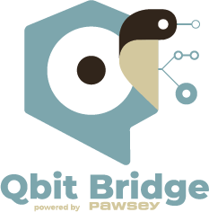
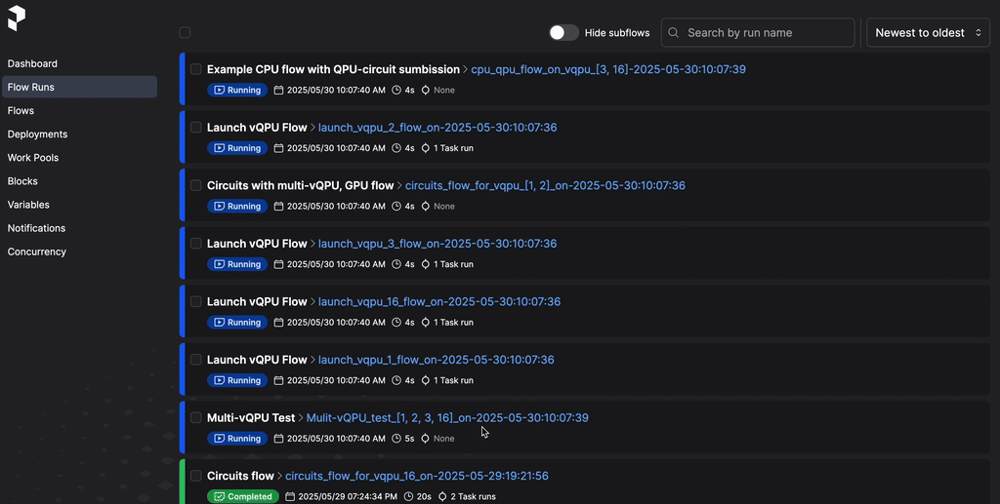
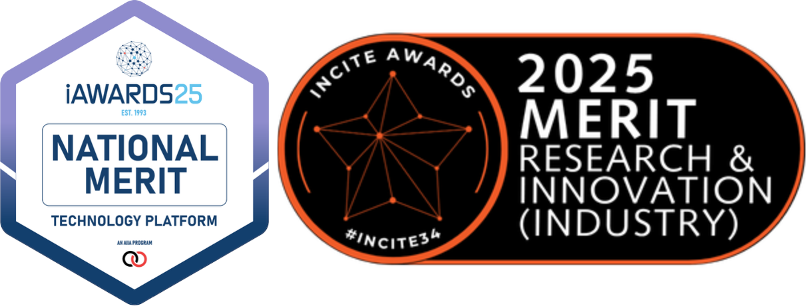

.. QBitBridge documentation master file, created by
   sphinx-quickstart on Wed May 28 13:14:26 2025.
   You can adapt this file completely to your liking, but it should at least
   contain the root `toctree` directive.

QBitBridge documentation
========================

QBitBridge is framework for running hybrid workflows containing (v)QPU, GPU and CPU oriented tasks on HPC systems. 
It is meant to ease the integration of quantum computing acceleration into a workflow, allowing rapid prototyping 
of quantum acceleration tasks. The framework uses `Prefect <https://www.prefect.io>`_ and 
`Slurm <https://slurm.schedmd.com/documentation.html>`_ (for more details see :ref:`description`). 

This has been developed at the Pawsey Supercomputing Research Centre's Quantum Supercomputing Innovation Hub. 
For bug reports or inquiries, please submit an issue on `GitHub <https://github.com/PawseySC/vqpu-hybrid-workflow>`_ 
or contact: `Pascal Jahan Elahi <mailto:pascal.elahi@pawsey.org.au?subject=QbitBridge Feedback>`_

Acknowledgements
----------------

We also acknowledge collaborators:

* `Quantum Brilliance <https://quantumbrilliance.com/>`_ who worked on a virtual QPU running on Pawsey supercomputing resources.
* `NVIDIA <https://nvidia.com>`_, specifically their `quantum computing group <https://nvidia.com/en-au/solutions/quantum-computing/>`_, 
  that worked with us and supported us with hardware. 
* Thanks to Alec Thomson and Tim Galvin for insightful conversations on Prefect. 

Recognition
-----------

QBitBridge has been recognised as an innovative project in the quantum computing space, and has been acknowledged in the following ways:

* A finalist and a merit recipient in the `2025 Western Australian Incite Awards <https://www.inciteawards.org.au/about-the-incite-awards/2025-winners/>`_
* A finalist and a merit recipient in the `2025 Australian Information Industry Association (AIIA) iAwards <https://aiia.com.au/iaward/2025-national-winners-and-merit-recipients/>`_

Contents
========

.. toctree::
   :maxdepth: 2

   description
   installation
   usage
   examples
   modules

Indices and Tables
==================

* :ref:`genindex`
* :ref:`modindex`
* :ref:`search`

